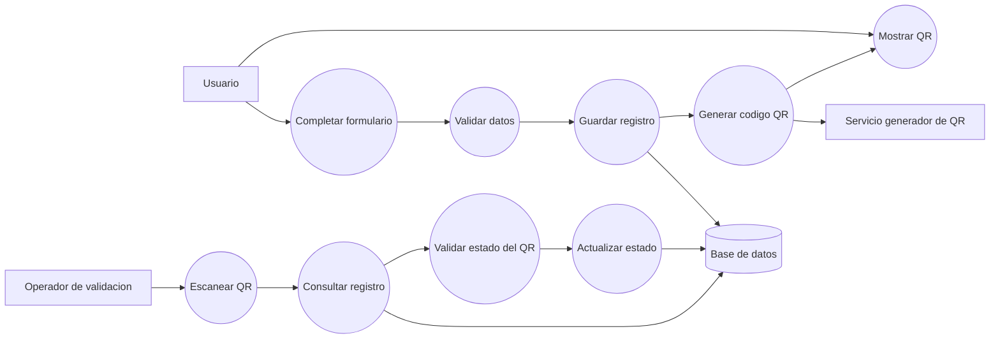
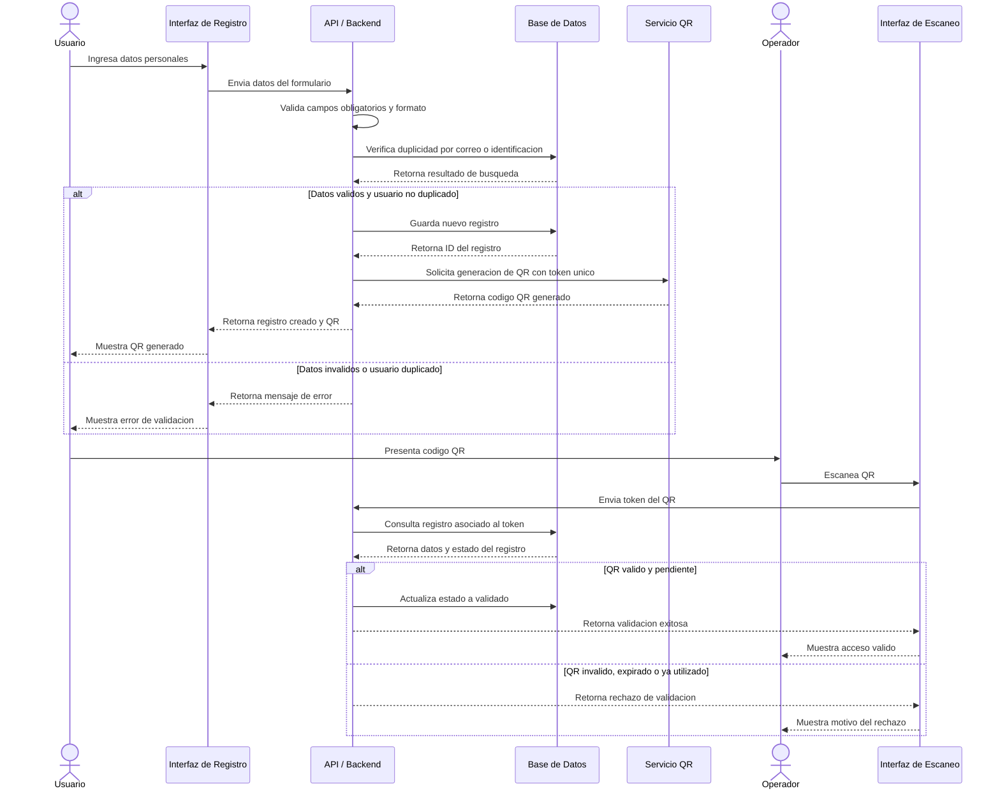
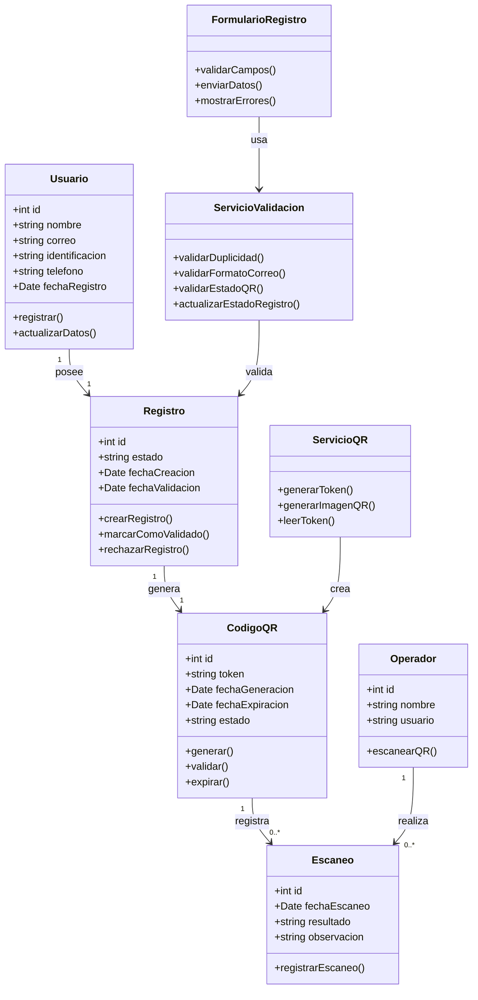
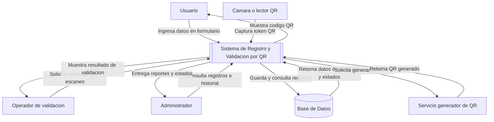

# Modelado del Sistema de Registro y Validación por QR

## 1. Caso de Uso

### Caso de Uso: Registrar Usuario y Validar Código QR

**Nombre:** Registrar usuario y validar código QR.

**Actor principal:** Usuario.

**Actores secundarios:**

* Operador de validación.
* Sistema de base de datos.
* Servicio generador de QR.

**Descripción:**  
El usuario ingresa sus datos en un formulario digital. El sistema valida la información, guarda el registro en la base de datos y genera un código QR único asociado al usuario. Posteriormente, el operador escanea el QR para verificar si el registro es válido y actualizar su estado.

**Precondiciones:**

* El sistema debe estar disponible.
* El formulario de registro debe estar habilitado.
* La base de datos debe estar operativa.
* El dispositivo de validación debe contar con cámara o lector de QR.

**Flujo principal:**

1. El usuario accede al formulario de registro.
2. El sistema muestra los campos requeridos.
3. El usuario ingresa sus datos personales.
4. El usuario envía el formulario.
5. El sistema valida que los campos obligatorios estén completos.
6. El sistema valida que el correo tenga un formato correcto.
7. El sistema verifica que el usuario no esté duplicado.
8. El sistema guarda el registro en la base de datos.
9. El sistema genera un identificador único para el registro.
10. El sistema genera un código QR asociado al identificador.
11. El sistema muestra el QR al usuario.
12. El usuario presenta el QR al operador.
13. El operador escanea el QR.
14. El sistema consulta el registro asociado.
15. El sistema valida el estado del QR.
16. El sistema muestra el resultado de la validación.
17. El sistema actualiza el estado del registro como validado.

**Flujos alternativos:**

* **A1 - Datos incompletos:** Si el usuario deja campos obligatorios vacíos, el sistema muestra un mensaje de error y no guarda el registro.
* **A2 - Correo inválido:** Si el correo no tiene formato válido, el sistema solicita corregir el campo.
* **A3 - Usuario duplicado:** Si el correo o identificación ya existe, el sistema rechaza el registro y muestra una alerta.
* **A4 - QR inválido:** Si el QR escaneado no existe en la base de datos, el sistema muestra el mensaje "QR inválido".
* **A5 - QR ya utilizado:** Si el QR ya fue validado previamente, el sistema muestra el mensaje "QR ya utilizado".

**Postcondiciones:**

* El usuario queda registrado en la base de datos.
* El QR queda asociado a un identificador único.
* El estado del registro se actualiza después de una validación exitosa.
* El sistema conserva la fecha y hora del escaneo.

**Resultado esperado:**  
El usuario se registra correctamente, recibe un código QR válido y el operador puede escanearlo para confirmar la autenticidad del registro.

## 2. Diagrama de Caso de Uso

## 3. Diagrama de Secuencia

## 4. Diagrama de Clases

## 5. Diagrama de Contexto

## 6. Resumen del Flujo General

El sistema inicia cuando el usuario llena el formulario de registro. Después, el backend valida los datos, evita duplicados y guarda la información. Una vez creado el registro, se genera un código QR único que se entrega al usuario. En la etapa de validación, el operador escanea el QR, el sistema consulta la base de datos, verifica el estado del registro y muestra si el QR es válido, inválido, expirado o ya utilizado.
