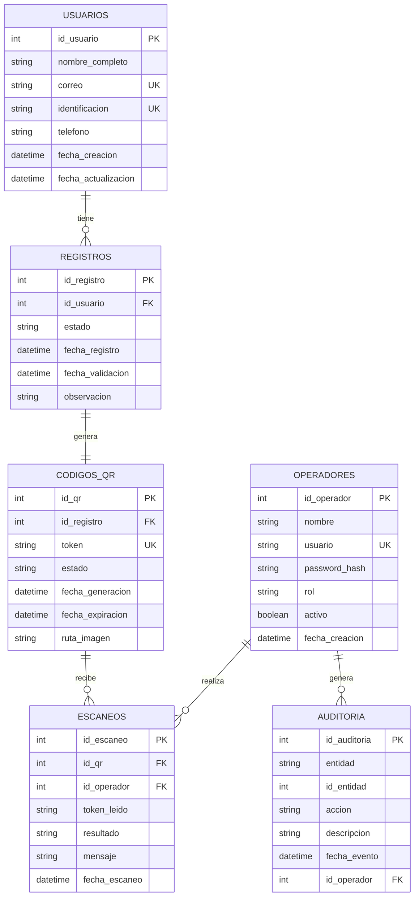

# Modelo de Base de Datos del Sistema de Registro y Validacion por QR

## 1. Objetivo del Modelo

Definir la estructura de datos necesaria para soportar el registro de usuarios mediante formulario, la generacion de codigos QR, el escaneo para validacion y la trazabilidad de eventos dentro del sistema.

El modelo busca garantizar:

* Integridad de datos.
* Prevencion de registros duplicados.
* Asociacion unica entre registro y codigo QR.
* Trazabilidad de escaneos.
* Consulta eficiente de usuarios, estados y validaciones.

## 2. Entidades Principales

Las entidades principales del sistema son:

* `usuarios`
* `registros`
* `codigos_qr`
* `operadores`
* `escaneos`
* `auditoria`

## 3. Tabla usuarios

Almacena la informacion personal capturada desde el formulario.

| Campo | Tipo de dato | Restriccion | Descripcion |
|---|---|---|---|
| `id_usuario` | INTEGER | PK, autoincremental | Identificador unico del usuario. |
| `nombre_completo` | VARCHAR(150) | NOT NULL | Nombre completo del usuario. |
| `correo` | VARCHAR(120) | NOT NULL, UNIQUE | Correo electronico del usuario. |
| `identificacion` | VARCHAR(50) | NOT NULL, UNIQUE | Numero de documento o identificador personal. |
| `telefono` | VARCHAR(30) | NOT NULL | Numero telefonico del usuario. |
| `fecha_creacion` | DATETIME | NOT NULL | Fecha y hora de creacion del usuario. |
| `fecha_actualizacion` | DATETIME | NULL | Fecha y hora de ultima actualizacion. |

### Restricciones

* El campo `correo` no debe repetirse.
* El campo `identificacion` no debe repetirse.
* El campo `nombre_completo` no debe estar vacio.

## 4. Tabla registros

Representa el registro operativo del usuario dentro del sistema. Permite separar la informacion personal del estado de validacion.

| Campo | Tipo de dato | Restriccion | Descripcion |
|---|---|---|---|
| `id_registro` | INTEGER | PK, autoincremental | Identificador unico del registro. |
| `id_usuario` | INTEGER | FK, NOT NULL | Usuario asociado al registro. |
| `estado` | VARCHAR(30) | NOT NULL | Estado actual del registro. |
| `fecha_registro` | DATETIME | NOT NULL | Fecha y hora en que se realizo el registro. |
| `fecha_validacion` | DATETIME | NULL | Fecha y hora de validacion exitosa. |
| `observacion` | VARCHAR(255) | NULL | Comentario administrativo opcional. |

### Estados permitidos

* `PENDIENTE`
* `VALIDADO`
* `EXPIRADO`
* `CANCELADO`

### Relaciones

* Un usuario puede tener uno o varios registros, segun las reglas futuras del sistema.
* Cada registro debe tener un usuario asociado.

## 5. Tabla codigos_qr

Almacena el token seguro utilizado para generar y validar el codigo QR.

| Campo | Tipo de dato | Restriccion | Descripcion |
|---|---|---|---|
| `id_qr` | INTEGER | PK, autoincremental | Identificador unico del QR. |
| `id_registro` | INTEGER | FK, NOT NULL, UNIQUE | Registro asociado al QR. |
| `token` | VARCHAR(255) | NOT NULL, UNIQUE | Token unico incluido dentro del QR. |
| `estado` | VARCHAR(30) | NOT NULL | Estado actual del codigo QR. |
| `fecha_generacion` | DATETIME | NOT NULL | Fecha y hora de generacion del QR. |
| `fecha_expiracion` | DATETIME | NULL | Fecha limite de validez del QR. |
| `ruta_imagen` | VARCHAR(255) | NULL | Ruta opcional donde se almacena la imagen del QR. |

### Estados permitidos

* `PENDIENTE`
* `VALIDADO`
* `EXPIRADO`
* `CANCELADO`

### Restricciones

* El campo `token` debe ser unico.
* El campo `id_registro` debe ser unico para garantizar un solo QR por registro.
* El QR no debe almacenar datos personales directamente.

## 6. Tabla operadores

Almacena los usuarios internos autorizados para escanear y validar codigos QR.

| Campo | Tipo de dato | Restriccion | Descripcion |
|---|---|---|---|
| `id_operador` | INTEGER | PK, autoincremental | Identificador unico del operador. |
| `nombre` | VARCHAR(120) | NOT NULL | Nombre del operador. |
| `usuario` | VARCHAR(80) | NOT NULL, UNIQUE | Nombre de usuario para acceso al sistema. |
| `password_hash` | VARCHAR(255) | NOT NULL | Hash de la contrasena del operador. |
| `rol` | VARCHAR(30) | NOT NULL | Rol del operador dentro del sistema. |
| `activo` | BOOLEAN | NOT NULL | Indica si el operador esta activo. |
| `fecha_creacion` | DATETIME | NOT NULL | Fecha de creacion del operador. |

### Roles permitidos

* `ADMIN`
* `OPERADOR`

### Restricciones

* La contrasena no debe almacenarse en texto plano.
* Solo operadores activos pueden validar codigos QR.

## 7. Tabla escaneos

Registra cada intento de escaneo realizado sobre un codigo QR.

| Campo | Tipo de dato | Restriccion | Descripcion |
|---|---|---|---|
| `id_escaneo` | INTEGER | PK, autoincremental | Identificador unico del escaneo. |
| `id_qr` | INTEGER | FK, NULL | Codigo QR asociado, si existe. |
| `id_operador` | INTEGER | FK, NULL | Operador que realizo el escaneo. |
| `token_leido` | VARCHAR(255) | NOT NULL | Token obtenido del QR escaneado. |
| `resultado` | VARCHAR(30) | NOT NULL | Resultado del escaneo. |
| `mensaje` | VARCHAR(255) | NOT NULL | Mensaje devuelto al operador. |
| `fecha_escaneo` | DATETIME | NOT NULL | Fecha y hora del escaneo. |

### Resultados permitidos

* `VALIDO`
* `INVALIDO`
* `YA_UTILIZADO`
* `EXPIRADO`
* `CANCELADO`
* `ERROR`

### Consideraciones

* Si el token no existe, `id_qr` puede quedar en `NULL`, pero el intento debe registrarse.
* Cada escaneo debe conservar el token leido para auditoria.

## 8. Tabla auditoria

Registra eventos importantes del sistema para trazabilidad.

| Campo | Tipo de dato | Restriccion | Descripcion |
|---|---|---|---|
| `id_auditoria` | INTEGER | PK, autoincremental | Identificador unico del evento. |
| `entidad` | VARCHAR(80) | NOT NULL | Entidad afectada. |
| `id_entidad` | INTEGER | NULL | Identificador de la entidad afectada. |
| `accion` | VARCHAR(80) | NOT NULL | Accion realizada. |
| `descripcion` | VARCHAR(255) | NULL | Detalle del evento. |
| `fecha_evento` | DATETIME | NOT NULL | Fecha y hora del evento. |
| `id_operador` | INTEGER | FK, NULL | Operador relacionado, si aplica. |

### Eventos recomendados

* `USUARIO_CREADO`
* `REGISTRO_CREADO`
* `QR_GENERADO`
* `QR_VALIDADO`
* `QR_RECHAZADO`
* `REGISTRO_CANCELADO`
* `ERROR_VALIDACION`

## 9. Relaciones entre Tablas

```text
usuarios 1 ---- N registros
registros 1 ---- 1 codigos_qr
codigos_qr 1 ---- N escaneos
operadores 1 ---- N escaneos
operadores 1 ---- N auditoria
```

## 10. Diagrama Entidad-Relacion



## 11. Script SQL Propuesto

```sql
CREATE TABLE usuarios (
    id_usuario INTEGER PRIMARY KEY AUTOINCREMENT,
    nombre_completo VARCHAR(150) NOT NULL,
    correo VARCHAR(120) NOT NULL UNIQUE,
    identificacion VARCHAR(50) NOT NULL UNIQUE,
    telefono VARCHAR(30) NOT NULL,
    fecha_creacion DATETIME NOT NULL,
    fecha_actualizacion DATETIME
);

CREATE TABLE registros (
    id_registro INTEGER PRIMARY KEY AUTOINCREMENT,
    id_usuario INTEGER NOT NULL,
    estado VARCHAR(30) NOT NULL,
    fecha_registro DATETIME NOT NULL,
    fecha_validacion DATETIME,
    observacion VARCHAR(255),
    FOREIGN KEY (id_usuario) REFERENCES usuarios(id_usuario)
);

CREATE TABLE codigos_qr (
    id_qr INTEGER PRIMARY KEY AUTOINCREMENT,
    id_registro INTEGER NOT NULL UNIQUE,
    token VARCHAR(255) NOT NULL UNIQUE,
    estado VARCHAR(30) NOT NULL,
    fecha_generacion DATETIME NOT NULL,
    fecha_expiracion DATETIME,
    ruta_imagen VARCHAR(255),
    FOREIGN KEY (id_registro) REFERENCES registros(id_registro)
);

CREATE TABLE operadores (
    id_operador INTEGER PRIMARY KEY AUTOINCREMENT,
    nombre VARCHAR(120) NOT NULL,
    usuario VARCHAR(80) NOT NULL UNIQUE,
    password_hash VARCHAR(255) NOT NULL,
    rol VARCHAR(30) NOT NULL,
    activo BOOLEAN NOT NULL,
    fecha_creacion DATETIME NOT NULL
);

CREATE TABLE escaneos (
    id_escaneo INTEGER PRIMARY KEY AUTOINCREMENT,
    id_qr INTEGER,
    id_operador INTEGER,
    token_leido VARCHAR(255) NOT NULL,
    resultado VARCHAR(30) NOT NULL,
    mensaje VARCHAR(255) NOT NULL,
    fecha_escaneo DATETIME NOT NULL,
    FOREIGN KEY (id_qr) REFERENCES codigos_qr(id_qr),
    FOREIGN KEY (id_operador) REFERENCES operadores(id_operador)
);

CREATE TABLE auditoria (
    id_auditoria INTEGER PRIMARY KEY AUTOINCREMENT,
    entidad VARCHAR(80) NOT NULL,
    id_entidad INTEGER,
    accion VARCHAR(80) NOT NULL,
    descripcion VARCHAR(255),
    fecha_evento DATETIME NOT NULL,
    id_operador INTEGER,
    FOREIGN KEY (id_operador) REFERENCES operadores(id_operador)
);
```

## 12. Consultas Basicas Esperadas

### Consultar usuario por correo

```sql
SELECT *
FROM usuarios
WHERE correo = ?;
```

### Consultar usuario por identificacion

```sql
SELECT *
FROM usuarios
WHERE identificacion = ?;
```

### Consultar QR por token

```sql
SELECT
    q.id_qr,
    q.token,
    q.estado AS estado_qr,
    q.fecha_expiracion,
    r.id_registro,
    r.estado AS estado_registro,
    u.nombre_completo,
    u.correo,
    u.identificacion
FROM codigos_qr q
INNER JOIN registros r ON q.id_registro = r.id_registro
INNER JOIN usuarios u ON r.id_usuario = u.id_usuario
WHERE q.token = ?;
```

### Actualizar registro como validado

```sql
UPDATE registros
SET estado = 'VALIDADO',
    fecha_validacion = ?
WHERE id_registro = ?;
```

### Actualizar QR como validado

```sql
UPDATE codigos_qr
SET estado = 'VALIDADO'
WHERE id_qr = ?;
```

### Registrar intento de escaneo

```sql
INSERT INTO escaneos (
    id_qr,
    id_operador,
    token_leido,
    resultado,
    mensaje,
    fecha_escaneo
) VALUES (?, ?, ?, ?, ?, ?);
```

## 13. Indices Recomendados

```sql
CREATE INDEX idx_usuarios_correo ON usuarios(correo);
CREATE INDEX idx_usuarios_identificacion ON usuarios(identificacion);
CREATE INDEX idx_codigos_qr_token ON codigos_qr(token);
CREATE INDEX idx_registros_estado ON registros(estado);
CREATE INDEX idx_escaneos_fecha ON escaneos(fecha_escaneo);
CREATE INDEX idx_escaneos_resultado ON escaneos(resultado);
```

## 14. Consideraciones de Seguridad

* El campo `password_hash` debe almacenar un hash seguro, no texto plano.
* El token del QR debe ser dificil de predecir.
* El QR no debe contener nombre, correo, identificacion ni telefono.
* Las consultas administrativas deben requerir autenticacion.
* Los intentos invalidos de escaneo deben registrarse para auditoria.

## 15. Consideraciones de Integridad

* No debe existir un QR sin registro asociado.
* No debe existir un registro sin usuario asociado.
* No deben repetirse correo, identificacion ni token.
* Un registro validado no debe volver a estado pendiente sin accion administrativa justificada.
* Cada cambio importante debe quedar reflejado en auditoria.
